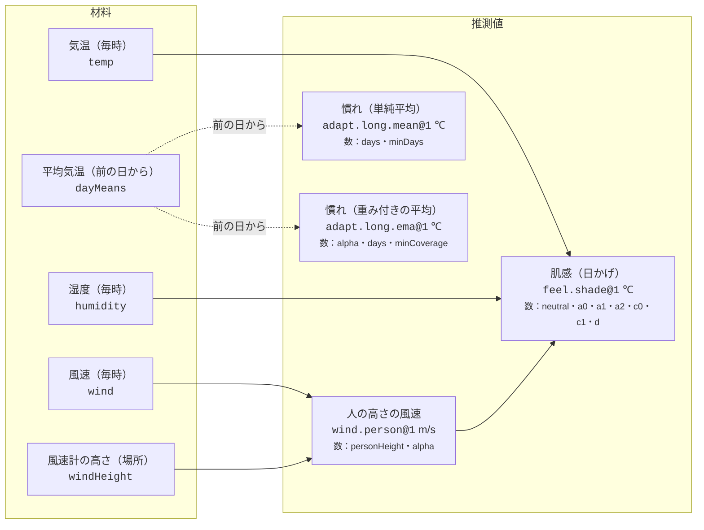

# core の依存の図

`src/core/map.ts` が計算式の `needs`・`series`・`params` から作る図（`npm run core-map`）。手で直さない。計算式を足す・変えると、テストがこの文書との違いを知らせる。

```mermaid
flowchart LR
  subgraph 材料
    temp["気温（毎時）<br><code>temp</code>"]
    humidity["湿度（毎時）<br><code>humidity</code>"]
    wind["風速（毎時）<br><code>wind</code>"]
    windHeight["風速計の高さ（場所）<br><code>windHeight</code>"]
    dayMeans["平均気温（前の日から）<br><code>dayMeans</code>"]
  end
  subgraph 推測値
    windPerson["人の高さの風速<br><code>wind.person@1</code> m/s<br><small>数：personHeight・alpha</small>"]
    feelShade["肌感（日かげ）<br><code>feel.shade@1</code> ℃<br><small>数：neutral・a0・a1・a2・c0・c1・d</small>"]
    adaptMean["慣れ（単純平均）<br><code>adapt.long.mean@1</code> ℃<br><small>数：days・minDays</small>"]
    adaptEma["慣れ（重み付きの平均）<br><code>adapt.long.ema@1</code> ℃<br><small>数：alpha・days・minCoverage</small>"]
  end
  wind --> windPerson
  windHeight --> windPerson
  temp --> feelShade
  humidity --> feelShade
  windPerson --> feelShade
  dayMeans -. 前の日から .-> adaptMean
  dayMeans -. 前の日から .-> adaptEma
```
